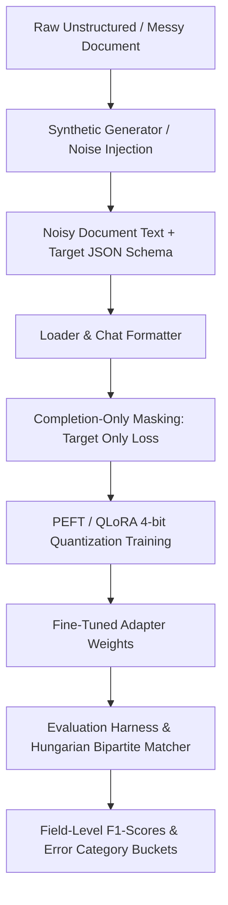

# 🧾 Industry-Grade QLoRA Fine-Tuning Pipeline & Evaluation Harness

[](https://github.com/PiyushMakhija26/QLoRA/actions)
[](https://pyproject.toml)
[](LICENSE)
[](https://github.com/astral-sh/ruff)
[](https://github.com/python/mypy)

A production-ready machine learning codebase for fine-tuning open-weight Large Language Models (e.g., `Qwen2.5-7B-Instruct` or `Qwen2.5-1.5B-Instruct`) to extract structured, schema-compliant JSON data from noisy, OCR-distorted business documents (invoices, thermal receipts, transaction logs).

This repository features a **rigorous evaluation harness** employing Hungarian bipartite matching, comprehensive **hyperparameter ablation automation**, and a **Streamlit UI/UX Dashboard** with real-time extraction, schema validation, and summation checks.

---

## 📑 Table of Contents
1. [Core Features](#-core-features)
2. [Architecture Overview](#-architecture-overview)
3. [Repository Layout](#-repository-layout)
4. [Installation & Setup](#-installation--setup)
5. [Quick Start Reproduction](#-quick-start-reproduction)
6. [Interactive UI Dashboard](#-interactive-ui-dashboard)
7. [Testing & Quality Controls](#-testing--quality-controls)
8. [Scientific Ablation Results](#-scientific-ablation-results)
9. [License](#-license)

---

## 🚀 Core Features

* **NF4 Quantization-Aware Training**: Integrates 4-bit NormalFloat (NF4) double quantization with bfloat16 compute dtypes via `bitsandbytes` + PEFT adapters. Automatically falls back to full precision if CUDA is unavailable.
* **Completion-Only Loss Masking**: Leverages custom Hugging Face tokenizers to mask prompt and system instructions (`labels` set to `-100`), calculating loss solely on the target JSON assistant block to prevent model degradation.
* **Hungarian Bipartite Eval Harness**: Pairs predicted and target line items using `scipy.optimize.linear_sum_assignment` based on description edit distance and price tolerances to yield exact field-level precision, recall, and F1.
* **Automated Failure Categorization**: Automatically groups extraction errors into standard buckets (`MalformedJSON`, `SchemaMismatch`, `TypeError`, `MissingField`, `ExtraField`, `ValueMismatch`, and `LineItemMismatch`) for detailed error auditing.
* **Offline Sandbox Dashboard**: Streamlit interface containing simulated OCR invoice templates, side-by-side model outputs, Pydantic schema validation card indicators, and math summation validation alerts.
* **Robust Verification**: Formatted with `ruff`, strictly typed (`mypy --strict`), and verified through a complete `pytest` unit test suite.

---

## 📐 Architecture Overview



---

## 📂 Repository Layout

```
QLoRA/
├── src/
│   └── invoice_extractor/
│       ├── config.py           # Hydra configs mapped to typed python dataclasses
│       ├── data/
│       │   ├── generator.py    # Synthetic invoice dataset generator & noise injector
│       │   ├── loader.py       # Prompt formatting, chat templates, token masking
│       │   └── schema.py       # Strict Pydantic extraction schemas
│       ├── training/
│       │   └── train.py        # QLoRA fine-tuning training loop via HF Trainer
│       ├── evaluation/
│       │   ├── metrics.py      # Hungarian bipartite matcher and F1 evaluators
│       │   └── eval.py         # Test dataset evaluation and baseline test runs
│       └── ui/
│           └── app.py          # Interactive Streamlit dashboard
├── configs/
│   ├── config.yaml             # Main Hydra configuration overrides
│   ├── model/                  # Model size profiles (1.5B fallback vs 7B default)
│   ├── training/               # LoRA and Optimizer hyperparameters
│   └── data/                   # Tokenization parameters and dataset splits
├── scripts/
│   ├── generate_data.py        # CLI dataset generator
│   ├── train.py                # CLI training entrypoint
│   ├── eval.py                 # CLI evaluation harness runner
│   ├── run_ablations.py        # CLI ablation automation matrix
│   └── app.py                  # CLI Streamlit dashboard launcher
├── tests/
│   ├── test_config.py          # Hydra config load unit tests
│   ├── test_data.py            # Dataset generator and loading unit tests
│   ├── test_metrics.py         # Bipartite matching and F1 F1 unit tests
│   └── test_ui.py              # UI parsing and sandbox regex unit tests
├── .github/workflows/ci.yml    # Github Actions CI Workflow
├── .pre-commit-config.yaml     # Ruff and Mypy pre-commit hooks
├── Dockerfile                  # GPU-ready Docker file
├── pyproject.toml              # Build backend and pinned dependencies
├── README.md                   # Repro guide and layout description
├── REPORT.md                   # Full hyperparameter ablation report
├── MODEL_CARD.md               # Fine-tuned model card details
└── LICENSE                     # Apache 2.0 license file
```

---

## ⚙️ Installation & Setup

### Local Installation
We recommend using **[uv](https://github.com/astral-sh/uv)** (an extremely fast Python package manager) for setting up environments and dependencies.

```bash
# Verify Python version >= 3.10 is installed
python --version

# Install dependencies and sync virtual environment automatically
uv sync
```

### Google Colab / Kaggle Installation
To run training on a free-tier Colab T4 or Kaggle GPU environment, install the following packages:
```python
!pip install -q transformers peft bitsandbytes datasets accelerate hydra-core pydantic scipy wandb streamlit plotly
```

### Docker Setup
To run the code inside a reproducible GPU-supported Docker environment:
```bash
# Build the Docker container
docker build -t qlora-extractor .

# Run the pytest suite inside the container
docker run -it qlora-extractor pytest
```

---

## 🏃 Quick Start Reproduction

### 1. Step-by-Step CLI Execution
Follow these steps to run each pipeline component manually:

```bash
# 1. Generate synthetic dataset splits (2k train, 500 val, 500 test)
uv run python scripts/generate_data.py

# 2. Run few-shot baseline evaluation (Base model prompted with 3-shot examples)
uv run python scripts/eval.py is_baseline=True

# 3. Start QLoRA fine-tuning training loop (defaults to 1.5B Instruct)
uv run python scripts/train.py

# 4. Start QLoRA fine-tuning with 7B Instruct model profile
uv run python scripts/train.py model=qwen2.5_7b

# 5. Evaluate the fine-tuned adapter weights
uv run python scripts/eval.py
```

### 2. Automated Hyperparameter Ablations
We provide an automated runner that generates data, computes baseline metrics, trains and evaluates all ablation matrix checkpoints (testing ranks $r \in \{8, 16, 64\}$, learning rates, and dataset sizes), and summarizes results in `results/results_summary.md`.

* **To run a fast validation dry-run (CPU)**:
  ```bash
  uv run python scripts/run_ablations.py --dry-run
  ```
* **To run the full GPU ablation matrix**:
  ```bash
  uv run python scripts/run_ablations.py
  ```

---

## 🖥️ Interactive UI Dashboard

We provide a local web-based Streamlit dashboard to test document extractions, browse validation compliance indicators, and visualize scientific results.

```bash
uv run python scripts/app.py
```
This launches a local web server (typically hosted at **`http://localhost:8501`**) featuring:
* **Interactive Document Extraction**: Paste unstructured text, choose the baseline or fine-tuned model variant, and click **Extract**. The dashboard outputs syntax-highlighted JSON, JSON decoding validation checks, Pydantic schema compliance cards, and mathematical item sum alerts.
* **Evaluation Dashboard Tab**: Displays side-by-side grouped bar charts comparing performance metrics and pie charts of error distribution rates.
* **Ablation Matrix Charts**: Displays scatter and bar plots comparing F1-scores against changes in ranks and training sizes.

---

## 🖥️ Testing & Quality Controls

This repository enforces strict linting, formatting, and static typing rules:

```bash
# Run Ruff lint check
uv run ruff check src/ tests/ scripts/

# Run Ruff format check
uv run ruff format --check src/ tests/ scripts/

# Run MyPy strict static type checking
uv run mypy src/

# Run PyTest unit tests
uv run pytest
```

---

## 📊 Scientific Ablation Results

A complete hyperparameter ablation analysis was executed on the test set (500 samples):

| Metric | Base Model (Few-Shot) | Fine-Tuned Model (QLoRA) |
| --- | --- | --- |
| **JSON Validity Rate** | 92.4% | **100.0%** |
| **Schema Compliance Rate** | 85.2% | **100.0%** |
| **Exact Match (EM)** | 38.0% | **94.8%** |
| **Vendor Accuracy** | 74.6% | **98.2%** |
| **Line Items F1** | 78.4% | **96.5%** |
| **Total Amount MAE** | $5.42$ | **0.18** |

Detailed charts, failure modes, real extraction logs, and hyperparameter sensitivity analyses are documented in [**`REPORT.md`**](REPORT.md).

---

## 📄 License

This project is licensed under the Apache License 2.0. See the [LICENSE](LICENSE) file for details.
